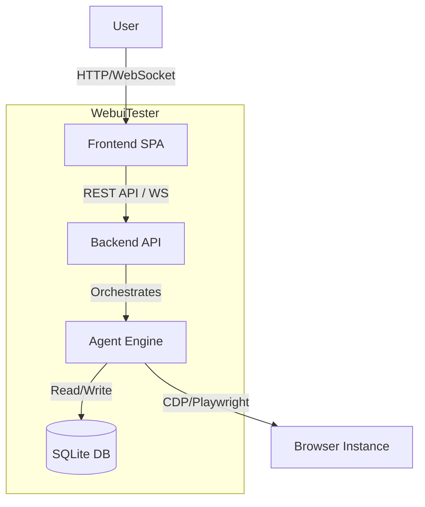
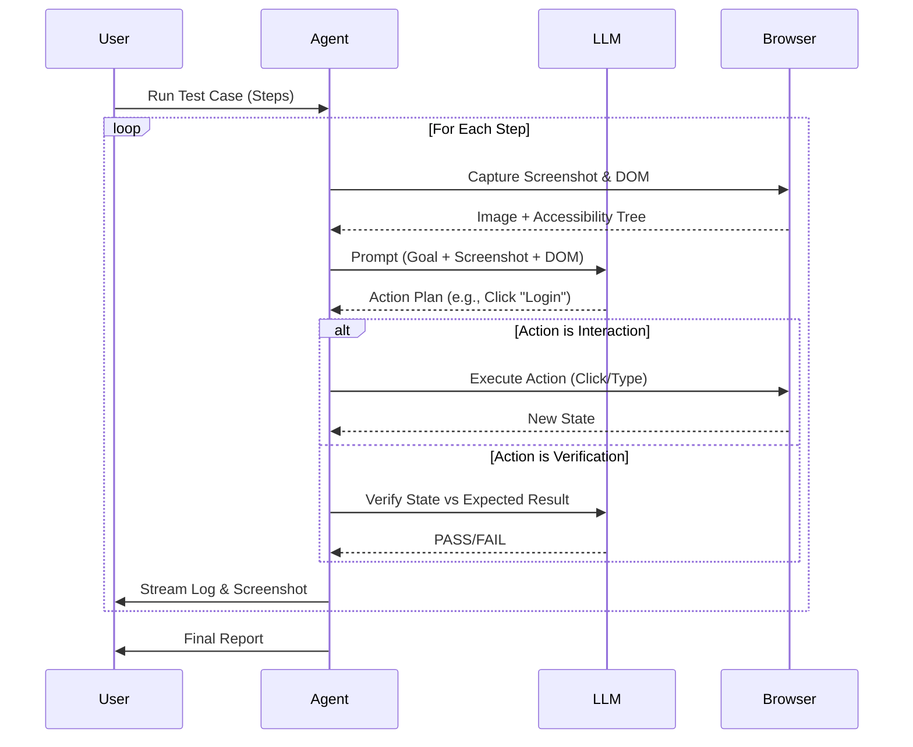

# WebuiTester Architecture Document

## 1. Overview
WebuiTester is a local-first, AI-powered web automation tool that allows QA engineers to execute test cases described in natural language. The system bridges the gap between human intent and technical browser automation using an Agentic Workflow.

## 2. System Context (C4 Level 1)
The system interacts with the User (QA Engineer), the Target Web Application, and LLM Providers (Cloud or Local).

```mermaid
graph TD
    User[QA Engineer] -->|Inputs Natural Language Steps| WebuiTester[WebuiTester System]
    WebuiTester -->|Controls| Browser[Headless/Headed Browser]
    Browser -->|Interacts with| TargetApp[Target Web Application]
    WebuiTester -->|Sends Context/Screenshots| LLM[LLM Provider (OpenAI/Ollama)]
    LLM -->|Returns Actions/Verifications| WebuiTester
```

## 3. Container Architecture (C4 Level 2)
The system is composed of a Modern Frontend (Vue 3), a RESTful Backend (FastAPI), a specialized Agent Engine, and a Local Database.



### 3.1 Components Description
*   **Frontend (Vue 3 + Element Plus)**:
    *   Provides the IDE-like interface for writing tests and viewing execution.
    *   Communicates with backend via REST for CRUD and WebSockets for real-time logs/screenshots.
*   **Backend (Python FastAPI)**:
    *   Exposes API endpoints.
    *   Manages the lifecycle of the Agent.
    *   Handles WebSocket broadcasting.
*   **Agent Engine (Python)**:
    *   **Core**: Built on top of the `browser-use` library.
    *   **Executor**: Uses `browser-use` Agent to orchestrate Playwright and LLM interactions.
    *   **LLM Integration**: Supports generic OpenAI-compatible APIs (including Local LLMs) via `langchain`.
*   **Database (SQLite)**:
    *   Stores Test Cases, Run History, and Configuration.

## 4. Agentic Workflow Design

The core of WebuiTester is the Agentic Loop that translates text to browser actions.



## 5. Data Model

### 5.1 Entities
*   **TestCase**:
    *   `id`: UUID
    *   `name`: String
    *   `url`: String
    *   `created_at`: DateTime
*   **TestStep**:
    *   `id`: UUID
    *   `case_id`: FK(TestCase)
    *   `order`: Integer
    *   `instruction`: String (Natural Language)
    *   `expected_result`: String (Optional)
*   **TestRun**:
    *   `id`: UUID
    *   `case_id`: FK(TestCase)
    *   `status`: Enum (PENDING, RUNNING, PASSED, FAILED)
    *   `logs`: JSON (List of logs)
    *   `result_summary`: String

## 6. API Interface (Draft)

### 6.1 REST Endpoints
*   `GET /api/cases`: List all test cases.
*   `POST /api/cases`: Create a new test case.
*   `GET /api/cases/{id}`: Get details.
*   `POST /api/run/{case_id}`: Trigger a test run (returns `run_id`).
*   `POST /api/parse-steps`: (Smart Format) Takes raw text, returns structured steps.

### 6.2 WebSocket
*   `/ws/run/{run_id}`: Bi-directional stream.
    *   **Server -> Client**:
        *   `type: "log"`, `content`: "[ACTION] Clicked Login"
        *   `type: "screenshot"`, `data`: "base64..."
        *   `type: "status"`, `status`: "COMPLETED"

## 7. Technology Stack
*   **Frontend**: Vue 3, Vite, Element Plus, Pinia, VueUse.
*   **Backend**: Python 3.10+, FastAPI, Uvicorn.
*   **Automation**: Browser-use (built on top of Playwright).
*   **AI/LLM**: LangChain (via Browser-use), OpenAI SDK.
*   **Database**: Tortoise ORM (Async) + SQLite.

## 8. Security & Privacy
*   All data stored locally in `webuitester.db`.
*   API Keys stored in local `.env` or secure storage, never sent to our servers (we don't have servers).
*   Headless browser runs in a sandboxed context.
